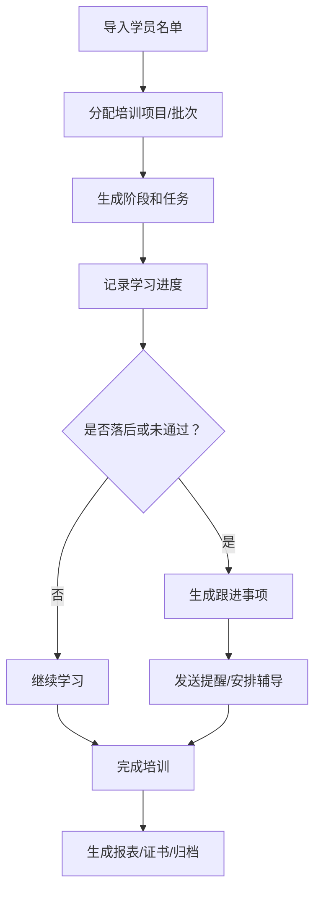

# 01-从业务到网站：核心方法论

培训进度网站不是从页面开始设计的，而是从业务流程开始设计。

核心公式：

```text
业务目标
  -> 使用角色
  -> 培训流程
  -> 数据对象
  -> 页面
  -> API
  -> 自动化脚本
  -> 部署和维护
```

## 第一步：写清楚业务目标

先回答这些问题：

| 问题 | 示例 |
|---|---|
| 这个培训项目叫什么？ | 2026 新员工入职培训 |
| 为什么要做网站？ | 每天自动查看学员进度和逾期情况 |
| 谁每天会用？ | HR、培训管理员、导师、部门经理 |
| 最重要的指标是什么？ | 完成率、逾期人数、考试通过率 |
| 最常见的操作是什么？ | 导入名单、筛选未完成、发送提醒、导出周报 |

给 AI 的提示词：

```text
请帮我把下面的培训项目整理成网站建设目标。
请输出：项目目标、使用人群、核心指标、日常操作、第一版范围、暂不做的功能。

项目描述：
【粘贴你的业务描述】
```

## 第二步：确定角色

常见角色：

| 角色 | 能做什么 |
|---|---|
| 超级管理员 | 管理所有项目、账号、权限、系统设置 |
| 培训管理员 | 管理学员、课程、导入、报表、跟进 |
| 培训师 / 导师 | 查看负责学员，更新进度，填写反馈 |
| 学员 | 查看自己的任务和反馈，提交材料 |
| 经理 / 只读用户 | 查看团队汇总和风险，不修改数据 |

角色必须决定页面和按钮。如果一个角色不能修改数据，就不应该看到编辑按钮。

## 第三步：画出培训流程

用最简单的流程表达：



如果你的项目有预约、评分、证书，把它们加进流程，而不是后面临时补。

## 第四步：列出数据对象

培训系统一般会有这些对象：

- 学员
- 用户
- 角色
- 培训项目
- 培训批次
- 阶段
- 任务
- 进度记录
- 跟进事项
- 导入记录
- 报表
- 通知
- 可选：预约
- 可选：评分
- 可选：证书

每个对象都要问：

- 谁创建？
- 谁查看？
- 谁修改？
- 是否从 Excel 导入？
- 是否要保留历史？
- 是否涉及隐私？

## 第五步：再设计页面

页面不是越多越好。每个页面都要对应一个明确工作：

| 页面 | 对应工作 |
|---|---|
| 首页看板 | 今天先处理什么 |
| 学员列表 | 找人、筛选、批量操作 |
| 学员详情 | 看一个人的完整情况 |
| 课程结构 | 定义阶段和任务 |
| 任务看板 | 看任务完成和逾期 |
| 导入页 | 把 Excel 变成系统数据 |
| 周报页 | 生成管理汇报 |
| 设置页 | 管理用户、权限和规则 |

## 第六步：设计后台管理

一个可用的后台不只是页面，还要考虑：

- 用户和角色怎么管理。
- 错误导入怎么处理。
- 谁能删除数据。
- 删除是否可以恢复。
- 每次导入是否有日志。
- 每次发送通知是否有记录。
- 系统是否有健康检查。
- 数据是否能备份和恢复。

## 第七步：让 AI 分阶段完成

不要让 AI 一次做完所有功能。推荐拆成这些阶段：

1. 需求文档和页面清单。
2. 数据模型和字段映射。
3. 静态页面和模拟数据。
4. 数据库和 API。
5. 导入功能。
6. 权限和登录。
7. 报表和通知。
8. 部署上线。
9. 维护、备份和自动化。

每个阶段都要验收后再进入下一步。
