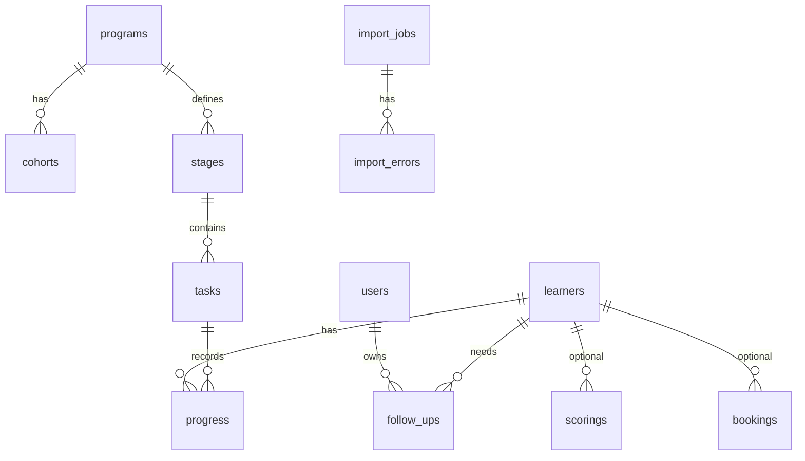

# 05-数据模型和字段映射：Excel 怎么变成网站数据

网站不是只有页面，还要有数据。数据模型就是告诉 AI：系统要保存哪些东西，它们之间有什么关系。

## 常见数据表

| 数据表 | 保存什么 |
|---|---|
| users | 登录账号和角色 |
| learners | 学员基础信息 |
| programs | 培训项目 |
| cohorts | 培训批次 |
| stages | 培训阶段 |
| tasks | 阶段下的任务 |
| progress | 学员任务完成情况 |
| follow_ups | 跟进事项 |
| import_jobs | 导入记录 |
| import_errors | 导入错误 |
| reports | 报表记录 |
| notifications | 通知记录 |
| bookings | 可选：预约 |
| scorings | 可选：评分 |
| certifications | 可选：证书 |

## 数据关系图



## 字段设计原则

- 每张表都要有 `id`。
- 每条重要记录都要有创建时间和更新时间。
- 涉及人工操作的记录要保存操作人。
- 状态字段要统一，例如 `not_started`、`in_progress`、`completed`、`overdue`。
- 不要用一个大文本字段塞所有信息。
- 不要把真实密码、密钥、身份证、敏感备注放进公开样例。

## Excel / CSV 字段映射模板

| Excel 字段名 | 含义 | 类型 | 是否必填 | 数据表 | 数据字段 | 页面 | 示例 | 校验 |
|---|---|---|---|---|---|---|---|---|
| 姓名 | 学员姓名 | 文本 | 是 | learners | name | 学员列表、详情 | 张三 | 不可为空 |
| 工号 | 内部编号 | 文本 | 是 | learners | employee_id | 列表、详情 | E1024 | 不可重复 |
| 邮箱 | 登录或通知邮箱 | 文本 | 否 | learners | email | 列表、通知 | test@example.com | 格式正确 |
| 部门 | 所属部门 | 文本 | 否 | learners | department | 看板、列表 | 销售部 | 可为空 |
| 批次 | 培训批次 | 文本 | 是 | cohorts | name | 看板、周报 | 2026 春季班 | 不可为空 |
| 当前阶段 | 学员阶段 | 文本 | 否 | progress | current_stage | 看板、详情 | 入职第 2 周 | 匹配阶段 |
| 完成率 | 总进度 | 数字 | 否 | progress | completion_rate | 看板、列表 | 75 | 0-100 |
| 任务名称 | 学习任务 | 文本 | 是 | tasks | title | 任务看板 | 产品测验 | 不可为空 |
| 截止日期 | 任务截止 | 日期 | 否 | tasks | due_date | 任务、周报 | 2026-07-15 | 日期格式 |
| 任务状态 | 完成情况 | 枚举 | 是 | progress | status | 任务、详情 | 已完成 | 预设值 |
| 分数 | 考试或作业成绩 | 数字 | 否 | scorings | score | 评分页 | 86 | 0-100 |
| 导师 | 负责人 | 文本 | 否 | learners | mentor_name | 列表、详情 | 李老师 | 可为空 |

## 导入流程

不要上传后直接写入数据库。推荐：

```text
上传文件
  -> 识别字段
  -> 预览前 20 行
  -> 校验必填和格式
  -> 检查重复和冲突
  -> 用户确认
  -> 正式导入
  -> 写入导入日志
```

## 冲突处理

| 冲突 | 推荐处理 |
|---|---|
| 邮箱已存在 | 默认跳过，用户确认后才更新 |
| 文件内重复学员 | 标出行号，不直接导入 |
| 阶段不存在 | 提示先创建阶段或映射字段 |
| 日期格式错误 | 标出具体行和字段 |
| 状态值未知 | 给出允许值 |
| 外部系统 ID 冲突 | 进入人工确认 |

## 给 AI 的提示词

```text
请根据我的 Excel 字段，帮我设计培训进度网站的数据模型和字段映射。

Excel 字段：
【粘贴字段名和几行脱敏样例】

请输出：
1. 需要哪些数据表
2. 每张表保存什么
3. 每个 Excel 字段映射到哪张表哪个字段
4. 哪些字段必填
5. 导入时要校验什么
6. 遇到重复数据怎么办
7. 哪些字段会显示在哪些页面

请先不要写代码。
```
